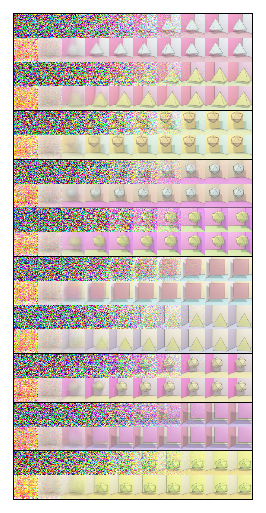

# Pytorch Lightning DDPM and DDIM Implementation

Pytorch Lightning implementation of DDPM and DDIM.

Below is the result of DDIM sampling on a toy dataset made with Blender.




The sampling process can be tested in `test.ipynb` notebook.

# References

```bibtex
@misc{ddpm,
  title = {Denoising Diffusion Probabilistic Models},
  author = {Ho, Jonathan and Jain, Ajay and Abbeel, Pieter},
  year = {2020},
  url = {https://arxiv.org/abs/2006.11239},
}
```
```bibtex
@misc{ddim,
  title = {Denoising Diffusion Implicit Models},
  author = {Song, Jiaming and Meng, Chenlin and Ermon, Stefano},
  year = {2020},
  url = {https://arxiv.org/abs/2010.02502},
}
```
[LabML Annotated Pytorch Implementation](https://nn.labml.ai/diffusion/index.html)
